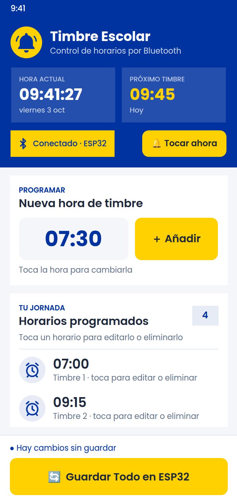

# Timbre Escolar: app para MIT App Inventor

Proyecto completo listo para importar en MIT App Inventor. Ya trae el diseño de la [guía de UI](../docs/guia-diseno-ui.md), todos los bloques programados y los íconos.

| Archivo | Qué es |
|---|---|
| **`TimbreEscolar.aia`** | **El proyecto para importar en App Inventor** |
| `vista-previa.png` | Cómo se ve la pantalla principal |
| `assets/` | Íconos PNG (campana, alarma y Bluetooth conectado/desconectado) y fuente **Poppins** (`.ttf`, licencia OFL en `OFL-Poppins.txt`) |
| `generar_aia.py` | Script que crea el `.aia`. Solo hace falta si quieres modificarlo desde código |
| [`../esp32/TimbreEscolar/TimbreEscolar.ino`](../esp32/TimbreEscolar/TimbreEscolar.ino) | Código para el ESP32 que entiende los mensajes de la app |

---



## 1. Importar la app

1. Descarga **`TimbreEscolar.aia`**: en GitHub, abre el archivo y pulsa **Download raw file** (↓).
2. Entra a **https://ai2.appinventor.mit.edu** con tu cuenta de Google.
3. Menú **Proyectos → Importar proyecto (.aia) desde mi ordenador** y elige el archivo.
4. Se abre el proyecto **TimbreEscolar** con la pantalla ya armada. En la pestaña **Bloques** está toda la lógica.
   > Si los bloques aparecen encimados: clic derecho en un área vacía → **Ordenar bloques verticalmente**.

## 2. Probar e instalar en el teléfono

- **Prueba rápida:** instala **MIT AI2 Companion** desde Play Store y, en App Inventor, ve a **Conectar → AI Companion** y escanea el código QR.
  > El Bluetooth funciona mejor con la app instalada (APK) que con el Companion.
- **Instalar de verdad:** **Compilar → Android App (.apk)**, descarga el APK en el teléfono e instálalo. Es posible que tengas que permitir "instalar apps de origen desconocido".
- La primera vez que te conectes, Android pedirá el permiso de **dispositivos cercanos / Bluetooth**. Acéptalo.

## 3. Preparar el ESP32

1. Abre `esp32/TimbreEscolar/TimbreEscolar.ino` en el **Arduino IDE**.
2. Instala la placa: **Herramientas → Placa → Gestor de tarjetas → "esp32" de Espressif**. Luego elige **ESP32 Dev Module**.
3. Revisa la sección de configuración al inicio del código:
   - `PIN_RELE = 26`: el pin donde conectas el módulo relé.
   - `RELE_ACTIVO_ALTO`: ponlo en `false` si tu relé se activa con LOW (muchos módulos de 1 canal funcionan así).
   - `DURACION_TIMBRE_MS = 5000`: cuánto dura cada timbrazo (5 s).
4. Súbelo al ESP32.
5. En el teléfono, ve a **Ajustes → Bluetooth** y **empareja "ESP32-Timbre"**. Este paso es obligatorio: la app solo muestra dispositivos ya emparejados.

> ⚠️ Usa un **ESP32 clásico** (WROOM / DevKit). Los ESP32-S2, S3, C3 y C6 no tienen Bluetooth clásico y no funcionan con App Inventor.
>
> ⚠️ Si el timbre funciona con 110/220 V, la conexión del relé a la red eléctrica debe hacerla un electricista.

## 4. Cómo se usa la app

1. Toca el badge **"Desconectado · Conectar"** y elige **ESP32-Timbre**. El badge se pone amarillo con el ícono azul.
2. Toca la hora grande, elige la hora y pulsa **＋ Añadir**. La lista se ordena sola y no admite horarios repetidos.
3. **Editar o borrar:** toca un horario de la lista y elige **✏️ Editar** (se abre el reloj con esa hora) o **🗑 Eliminar**.
4. **Tocar el timbre ahora:** pulsa **🔔 Tocar ahora** en el encabezado y confirma. Así se evita que suene por un toque accidental.
5. Pulsa **🔄 Guardar Todo en ESP32**. La app envía la **hora actual del teléfono** (para poner en hora el ESP32) y la **lista completa**.

En el encabezado ves siempre la **hora actual** y el **próximo timbre** (de hoy, o el primero de mañana).

La lista también queda guardada en el teléfono (TinyDB), así que sigue ahí al cerrar la app.

---

## Mensajes entre la app y el ESP32

La app envía texto por Bluetooth, una línea por mensaje:

```
HORA=2026-10-03 07:30:00
HORARIOS=07:00,09:15,09:45,12:30
```

El botón **🔔 Tocar ahora** envía:

```
TOCAR
```

El ESP32 responde `OK HORA`, `OK 4 HORARIOS` y `OK TOCAR`. Si ya tienes tu propio código para el ESP32, solo tienes que adaptarlo para leer estas tres líneas.

**Importante:** el ESP32 no tiene un reloj con batería. **Si se va la luz, pierde la hora** (los horarios sí se conservan) y el timbre no sonará hasta que vuelvas a pulsar **Guardar Todo en ESP32**. El LED azul integrado (pin 2) encendido indica que la hora está sincronizada. Para una instalación fija se recomienda añadir un módulo **RTC DS3231**.

---

## Diferencias con la guía de diseño

App Inventor tiene algunos límites visuales. Esto es lo que cambió y por qué:

| Guía de diseño | En App Inventor |
|---|---|
| Sombras suaves en tarjetas | No existen. Se usan tarjetas blancas sobre fondo gris `#F4F6F9`, más una línea divisoria sobre la barra inferior |
| Encabezado con esquinas inferiores redondeadas y tarjeta que se solapa | Encabezado recto, con 14 px de separación |
| Badge en forma de píldora | Badge rectangular (los contenedores no se pueden redondear) |
| Papelera en cada fila y deslizar para borrar | Se toca la fila y aparece un diálogo con **✏️ Editar** y **🗑 Eliminar** |
| Íconos Material | PNG propios (campana, alarma, Bluetooth) y emojis en los botones (🔔 🔄) |
| Fuente Poppins | ✔ **Incluida**: Poppins Bold en títulos y horas, SemiBold en botones, Regular en textos |

Los colores, la fuente, las alturas de botones, los estados (conectado/desconectado, botón deshabilitado, lista vacía) y los textos sí siguen la guía.

---

## Problemas comunes

| Problema | Solución |
|---|---|
| La lista de dispositivos sale vacía | Empareja el ESP32 en Ajustes → Bluetooth y activa el Bluetooth |
| "No se pudo conectar" | Verifica que el ESP32 esté encendido y que ningún otro teléfono esté conectado a él |
| "Error 507" o "Error 515" | Igual que el anterior: el ESP32 está fuera de alcance o apagado. Vuelve a conectar desde el badge |
| El timbre no suena a la hora | Pulsa **Guardar Todo en ESP32** después de cada corte de luz. Revisa también `RELE_ACTIVO_ALTO` |
| "Tocar ahora" no hace nada | Vuelve a subir al ESP32 el `.ino` de esta carpeta: la versión anterior no reconocía `TOCAR` |
| Los textos no salen con Poppins | En el Diseñador, revisa que los `.ttf` estén en *Media*. Si los borraste, vuelve a importar el `.aia` |
| Al importar sale "proyecto de una versión más nueva" | Avísame y genero el `.aia` con versiones más antiguas (`generar_aia.py`, variables `YA_VERSION` y `VERSIONES`) |

## Modificar el proyecto desde código (opcional)

Edita `generar_aia.py` (textos, colores, bloques) y ejecuta:

```bash
python3 generar_aia.py
```

Se vuelve a crear `TimbreEscolar.aia`. También puedes hacer los cambios directamente en App Inventor después de importar.
