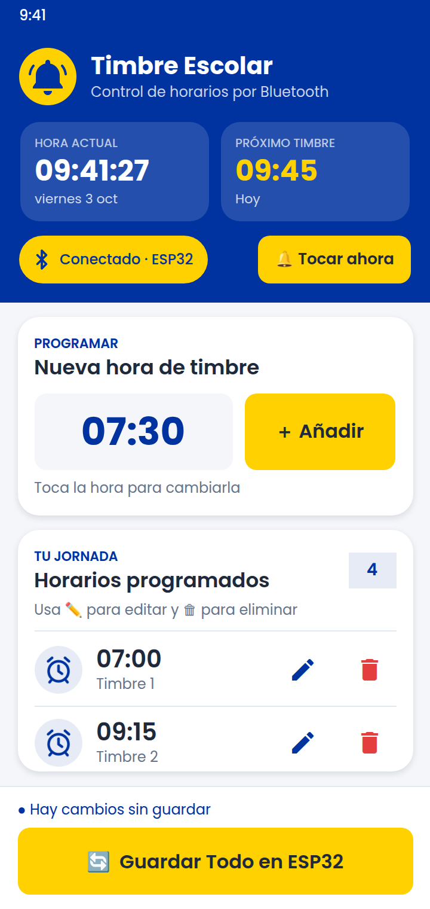

# Timbre Escolar: versión para Kodular

Proyecto para **Kodular Creator** (https://creator.kodular.io), gratuito. Comparado con la versión de App Inventor, se parece mucho más a la guía de diseño:

- **Tarjetas reales** con esquinas redondeadas y sombra (componente *Card View*).
- Indicador de Bluetooth en forma de **píldora** y recuadros del encabezado redondeados.
- **Botones de editar (✏️) y borrar (🗑) en cada fila**, con íconos Material.
- Fuente **Poppins**.

> La imagen es una simulación hecha en el navegador; en el teléfono puede haber pequeñas diferencias.

| Archivo | Qué es |
|---|---|
| **`TimbreEscolar_Kodular.aia`** | **El proyecto para importar en Kodular** |
| `generar_aia_kodular.py` | Script que crea el `.aia`. Usa los íconos y fuentes de `../app-inventor/assets` |
| [`../esp32/TimbreEscolar/TimbreEscolar.ino`](../esp32/TimbreEscolar/TimbreEscolar.ino) | Código del ESP32 (es el mismo que para App Inventor) |

## 1. Importar en Kodular

1. Descarga **`TimbreEscolar_Kodular.aia`**: en GitHub, abre el archivo y pulsa **Download raw file** (↓).
2. Entra a **https://creator.kodular.io** con tu cuenta de Google.
3. En la pantalla de proyectos, pulsa la flecha junto a **Create Project** (Crear proyecto) → **Import project** → elige el archivo.
4. Se abre el proyecto **TimbreEscolar**. En la pestaña **Blocks** está toda la lógica.
   > Si los bloques aparecen encimados: clic derecho en un área vacía → **Arrange Blocks Vertically** (ordenar bloques verticalmente).

## 2. Probar e instalar

- **Prueba rápida:** instala **Kodular Companion** desde Play Store y, en Kodular, ve a **Test → Connect to Companion** y escanea el código QR.
- **Instalar de verdad:** **Export → Android App (.apk)**, descárgalo en el teléfono e instálalo.
- Acepta el permiso de **dispositivos cercanos / Bluetooth** la primera vez que te conectes.

## 3. ESP32

Es el mismo código que para App Inventor. Sigue los pasos de [`../app-inventor/README.md`](../app-inventor/README.md#3-preparar-el-esp32) (sección 3) y empareja **"ESP32-Timbre"** en los ajustes de Bluetooth del teléfono.

## Cómo se usa

1. Toca la píldora **"Desconectado · Conectar"** y elige **ESP32-Timbre**.
2. Toca la hora grande, elige la hora y pulsa **＋ Añadir**. Admite **hasta 20 horarios**, que se ordenan solos y sin repetidos.
3. En cada fila: **✏️** abre el reloj para cambiar esa hora y **🗑** la elimina (pide confirmación).
4. **🔔 Tocar ahora** hace sonar el timbre al momento (pide confirmación).
5. **🔄 Guardar Todo en ESP32** envía la hora del teléfono y la lista completa.

## Detalles técnicos

- **Filas:** hay 20 filas ya armadas en el diseño. Los bloques muestran una fila por cada horario y ocultan el resto.
- **Botones de las filas:** un solo bloque *"cuando cualquier Botón.Click"* atiende los 40 botones de editar y borrar.
- **Íconos:** los lápices y papeleras son texto con la fuente *Material Icons*, que convierte la palabra `edit` en ✏️ y `delete` en 🗑. Si los ves como palabras, revisa que `MaterialIcons-Regular.ttf` esté en **Assets**.

## Problemas comunes

| Problema | Solución |
|---|---|
| Kodular no acepta el archivo al importar | Mándame el mensaje de error exacto para ajustarlo. Kodular es de código cerrado y el formato lo tomé de un proyecto exportado por Kodular |
| Las tarjetas no tienen sombra o esquinas redondeadas | En el diseñador, selecciona la tarjeta (*Card View*) y revisa **Corner Radius** (18) y **Elevation** (2) |
| Los textos no salen en Poppins | Revisa que los `.ttf` estén en **Assets**. Si los borraste, vuelve a importar el `.aia` |

Para los problemas de Bluetooth, mira la tabla de [`../app-inventor/README.md`](../app-inventor/README.md#problemas-comunes).
